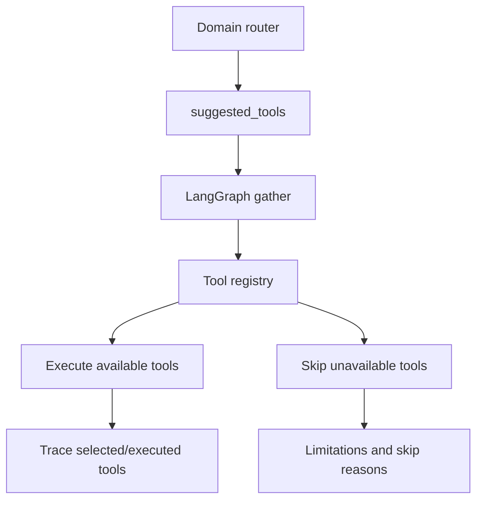
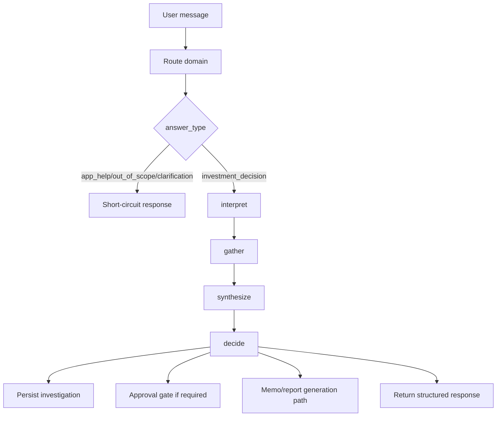

# Agent Workflow

## 1) Normal LLM vs AlphaLens Agent

Normal chatbot behavior:

- Answers mainly from prompt context and model prior
- Usually returns text without explicit operational workflow state

AlphaLens agent behavior:

- Routes the request (`app_help`, `out_of_scope`, `clarification`, `investment_decision`)
- Calls tools and retrieval paths when needed
- Applies policy/risk framing and limitations
- Persists investigations, approvals, and reports context
- Returns structured metadata for UI traceability

## 2) Domain Routing

Supported answer types:

- `app_help`
- `out_of_scope`
- `clarification`
- `investment_decision`

Non-investment answer types short-circuit and intentionally skip investment-only tooling.

## 3) Tool Routing

`gather` merges router suggestions with deterministic logic, normalizes aliases, executes known tools, and records skipped tools/limitations without crashing the run.

## 4) LangGraph Nodes

- `interpret`: classify intent and decision context
- `gather`: collect tool/RAG evidence and orchestration trace
- `synthesize`: produce grounded analysis
- `decide`: produce recommendation metadata and governance signals

## 5) Example Flows

- “How many languages do you support?” -> `app_help` short-circuit
- “What does internal policy say about concentration?” -> `investment_decision` + RAG/policy tools
- “Why is NVDA moving today?” -> `investment_decision` + market/news tool path
- “What does the latest 10-K say about NVDA risks?” -> `investment_decision` + SEC path (or documented limitation)
- “How would higher rates affect the portfolio?” -> `investment_decision` + macro/portfolio path
- “What happens if NVDA drops 10 percent?” -> `investment_decision` + scenario-style first-order portfolio impact fallback in chat

## 6) Failure Handling and Resilience

- Provider fallbacks keep the app usable when external APIs are unavailable
- Unavailable/unknown tools are skipped with explicit limitations and trace entries
- Expired JWTs return `401` (not `500`)
- Frontend chat timeout is tuned for long macro/news/SEC answers

## 7) End-to-End Flow

