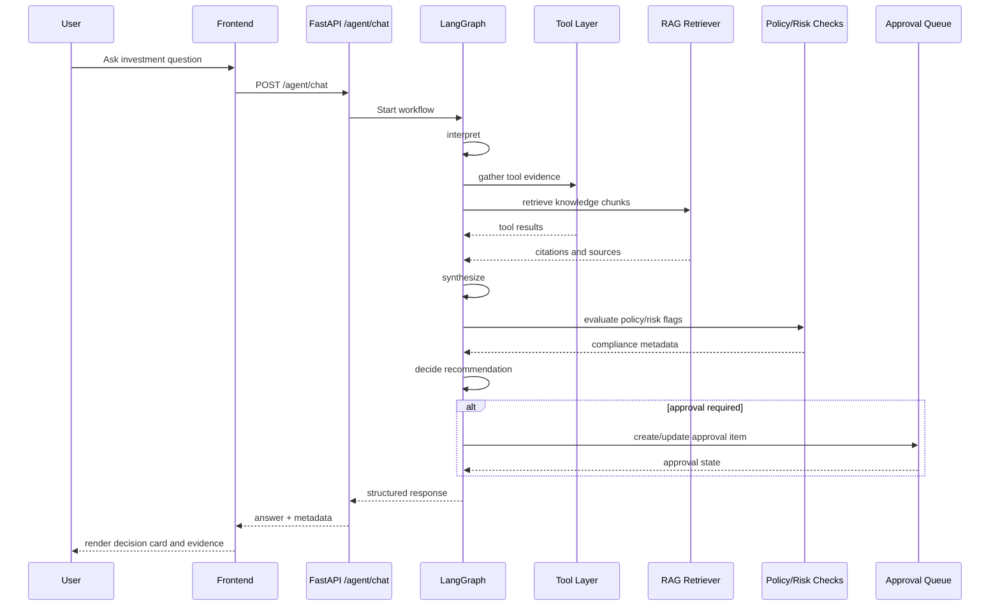

# Agent Workflow

## 1) Why This Is an Agent (Not a Basic Chatbot)

AlphaLens AI is agentic because it performs multi-step orchestration with tool use, retrieval, policy checks, and explicit decision gating. A standard chatbot usually returns free-form text from a single prompt. AlphaLens instead:
- interprets task intent;
- selects and executes tools;
- gathers structured evidence from portfolio, policy, and external sources;
- applies risk/compliance checks;
- decides whether human approval is required;
- returns typed response metadata for UI governance.

## 2) LangGraph Workflow

Core stages:
- `interpret`: classify user request, determine objective, and detect sensitive intent;
- `gather`: call tool layer and RAG retriever for evidence collection;
- `synthesize`: combine evidence into coherent analysis with caveats;
- `decide`: generate recommendation, confidence, rationale, and compliance metadata.

## 3) Intent Detection

Intent detection routes requests into categories such as:
- portfolio performance analysis;
- policy or compliance checks;
- security/ticker investigations;
- RAG summary and document-based questions;
- memo/report generation;
- scenario simulation requests.

Intent classification informs tool selection, evidence depth, and approval checks.

## 4) Tool Selection

The agent selects tools based on detected intent and data requirements:
- portfolio analyzer;
- risk checker;
- policy rules;
- RAG retriever;
- market data;
- web/news search;
- macro indicators;
- SEC filing retrieval.

## 5) Portfolio Analyzer

Portfolio analyzer tools compute position-level and aggregate signals, including concentration, exposure, and recent behavior from synthetic or configured data backends.

## 6) Risk Checker

Risk checker evaluates potential risk flags before recommendations are finalized. It contributes to recommendation confidence and approval requirement decisions.

## 7) Policy Rules

Policy tools compare recommendations against internal investment policy constraints. Breach indicators are emitted as structured flags and included in response metadata.

## 8) RAG Retriever

RAG retrieves relevant context from internal and uploaded documents, grounding decisions in organization-specific knowledge instead of only model priors.

## 9) Market Data

Market tools fetch quote/performance context from configured providers (or fallback mode), enabling near-term performance and position framing.

## 10) Web/News

Search/news tools gather external context where available, especially for event-sensitive analysis. Fallback mode preserves deterministic behavior if providers are disabled.

## 11) Macro

Macro tools (e.g., FRED-based indicators) provide broad economic context for sector and risk interpretation.

## 12) SEC Filings

SEC tools add filing-aware context for public companies and support evidence-backed decision narratives.

## 13) Approval Gate

When policy/risk conditions are met (or evidence is weak), the agent marks a recommendation as requiring human review and sends it into the approval workflow.

## 14) Response Structure in the UI

Response payloads are designed for transparent rendering:
- final answer;
- tools used;
- RAG sources;
- provider mode (real/fallback);
- data used;
- limitations;
- orchestration trace.

## Agent Execution Sequence

