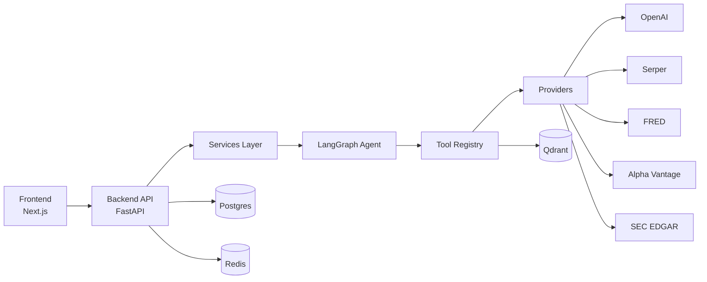
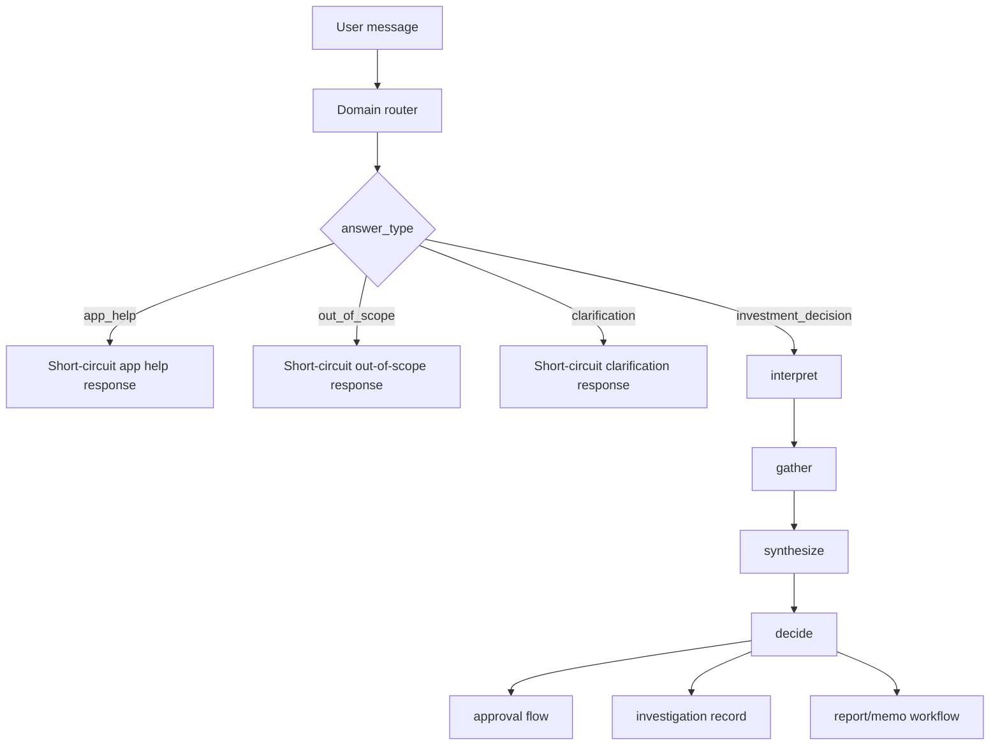
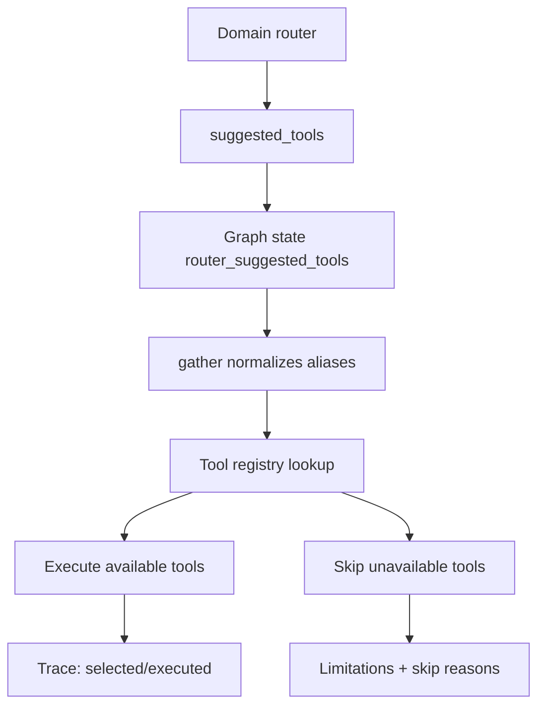
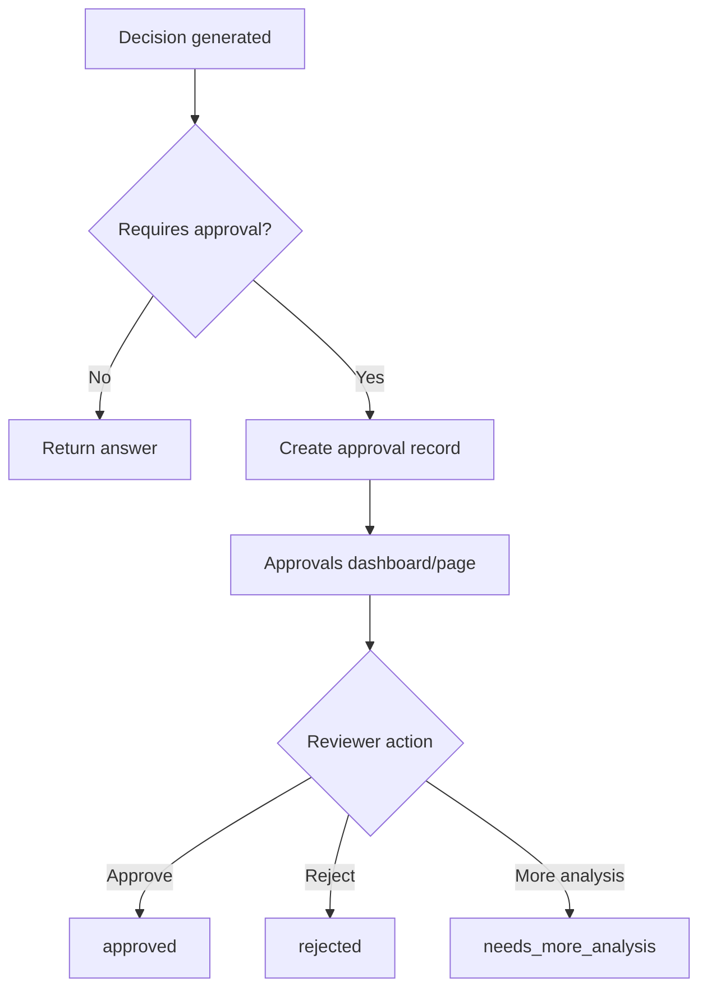
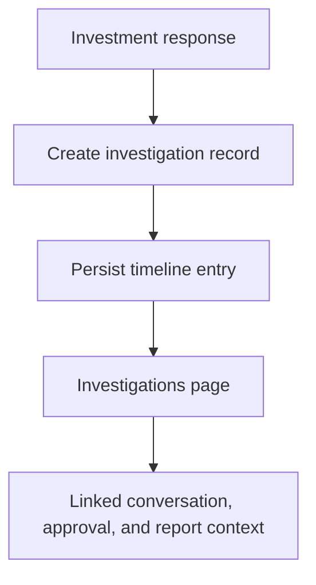
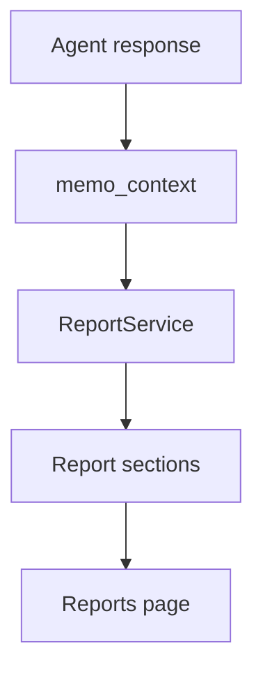
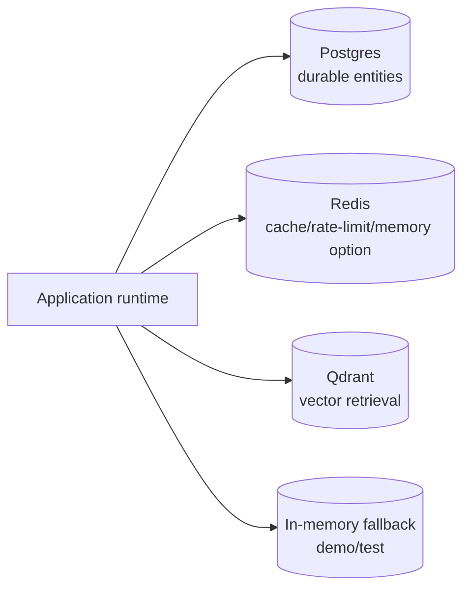

# Architecture

AlphaLens AI is a full-stack agentic platform where frontend workflows call typed FastAPI endpoints, and investment decisions are orchestrated through LangGraph with tools, retrieval, governance, and durable records.

## A) System Architecture

## B) Agent Workflow

## C) Router to LangGraph Tool Wiring

## D) Human Approval Workflow

## E) Investigation Workflow

## F) Report and Memo Workflow

## G) Persistence Model

## Notes

- Router suggestions are first-class graph input and are merged with deterministic tool logic in `gather`.
- Tool orchestration trace tracks selected tools, executed tools, skipped tools, and limitations.
- Investigations and reports are persisted entities, not transient UI-only artifacts.
