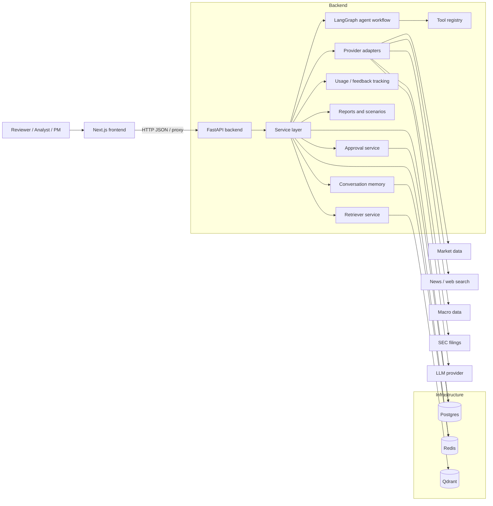
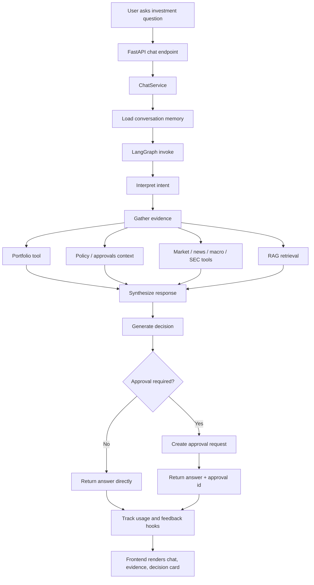
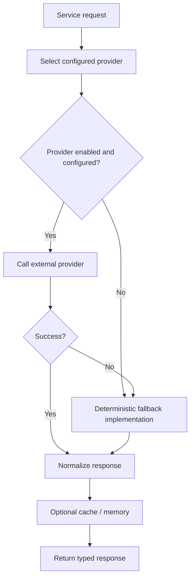
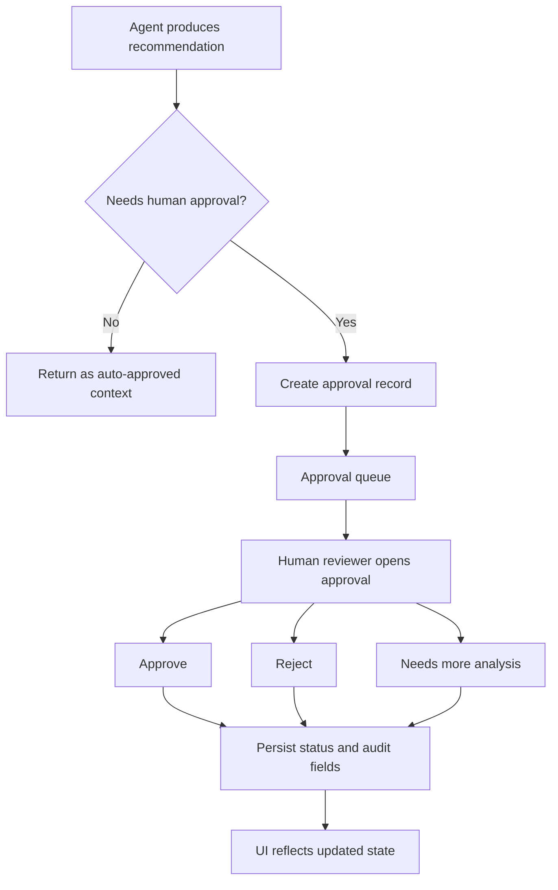
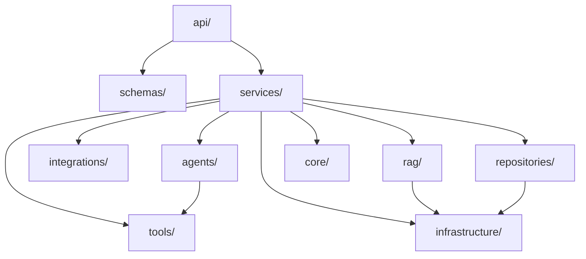

# Architecture

AlphaLens AI is designed as a reviewer-friendly fintech AI system: typed
contracts, explicit agent orchestration, deterministic fallback behavior, and
human approval as a first-class control rather than an afterthought.

## System Architecture

### Summary

- The frontend is the reviewer surface: dashboard, chat, approvals, reports,
  scenarios, usage, knowledge base, and settings.
- The backend owns business logic, orchestration, provider selection, fallback
  handling, and typed API contracts.
- Postgres, Redis, and Qdrant are the primary infrastructure dependencies, but
  the product remains usable when optional providers are disabled.

## Agent Workflow

### What matters for reviewers

- The workflow is explicit instead of opaque.
- Tool use is inspectable in the UI and traceable in backend services.
- The decision layer is separated from raw response generation.
- Approval escalation is a deliberate branch in the workflow.

## Tool and Provider Fallback Architecture

### Why this design

- Reviewer demos should not fail because an external key is missing.
- Tests and local development should remain deterministic.
- Provider adapters can evolve independently without changing UI contracts.
- The service layer always returns normalized models, regardless of whether the
  source was live or fallback data.

## Human Approval Workflow

### Reviewer value

- The recommendation is not the final authority.
- The queue makes human-in-the-loop behavior visible.
- Approval state is durable when Postgres persistence is enabled.
- Auditability is clearer than a free-form chat transcript alone.

## Backend Layering

The backend lives in `backend/src/alphalens/` and is organized to keep
transport, orchestration, tools, providers, and persistence separate.

- `api/`: FastAPI app and route wiring
- `schemas/`: Pydantic contracts shared across request and response boundaries
- `services/`: business orchestration and provider selection
- `agents/`: LangGraph state and node execution
- `tools/`: callable capabilities the agent can use
- `integrations/`: provider adapters for live and fallback sources
- `repositories/`: persistence abstraction, currently most important for
  approvals
- `rag/`: retrieval and knowledge-base access
- `infrastructure/`: Redis, Postgres, Qdrant, observability, and lower-level
  clients
- `core/`: config, logging, and cross-cutting concerns

## Frontend Structure

- App Router pages provide dedicated reviewer surfaces for dashboard, chat,
  approvals, reports, scenarios, usage, knowledge base, investigations, and
  settings.
- Shared UI primitives enforce consistent spacing, badges, skeletons, tables,
  and error banners.
- `src/lib/api.ts` centralizes frontend API access and deterministic fallback
  handling so the UI remains usable even if the backend is unreachable.

## Key Design Decisions

### 1. Typed API contracts end to end

FastAPI + Pydantic keep request and response shapes explicit, which reduces
guesswork across the frontend, tests, and reviewer demos.

### 2. Deterministic fallbacks over brittle live-only demos

Fallbacks are intentional, not accidental. AlphaLens is designed to remain
stable in local, CI, and reviewer environments where keys or network access may
be missing.

### 3. Human approval as a core product flow

Approval is not a post-processing note. It is an explicit state transition in
the system and a visible surface in the UI.

### 4. Service-layer provider abstraction

Providers are selected and normalized in services instead of directly in the UI
or agent nodes. That keeps contracts stable and makes fallback behavior easy to
reason about.

### 5. MVP persistence is selective

Approvals have a stronger persistence path because they matter for auditability.
Other MVP services may remain in-memory to keep scope controlled while still
demonstrating the intended system shape.

## Related Docs

- [README.md](../README.md)
- [setup.md](setup.md)
- [decisions.md](decisions.md)
- [demo_script.md](demo_script.md)
- [validation_report.md](validation_report.md)
