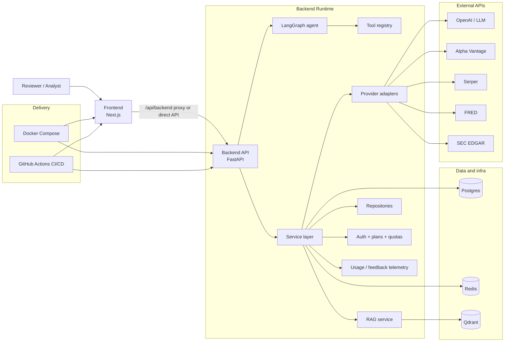
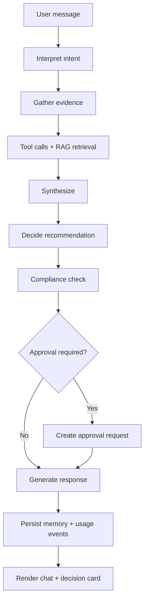
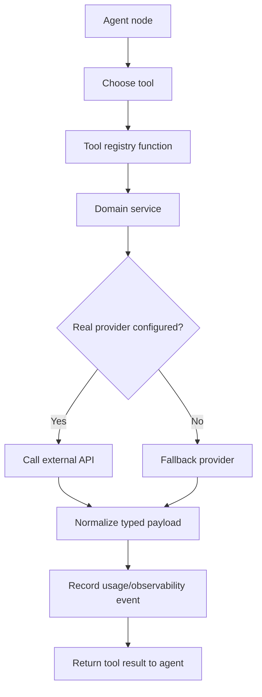
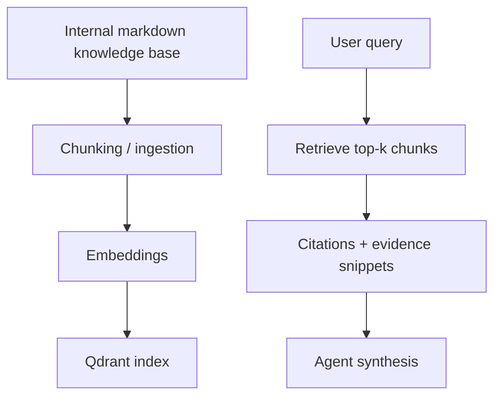
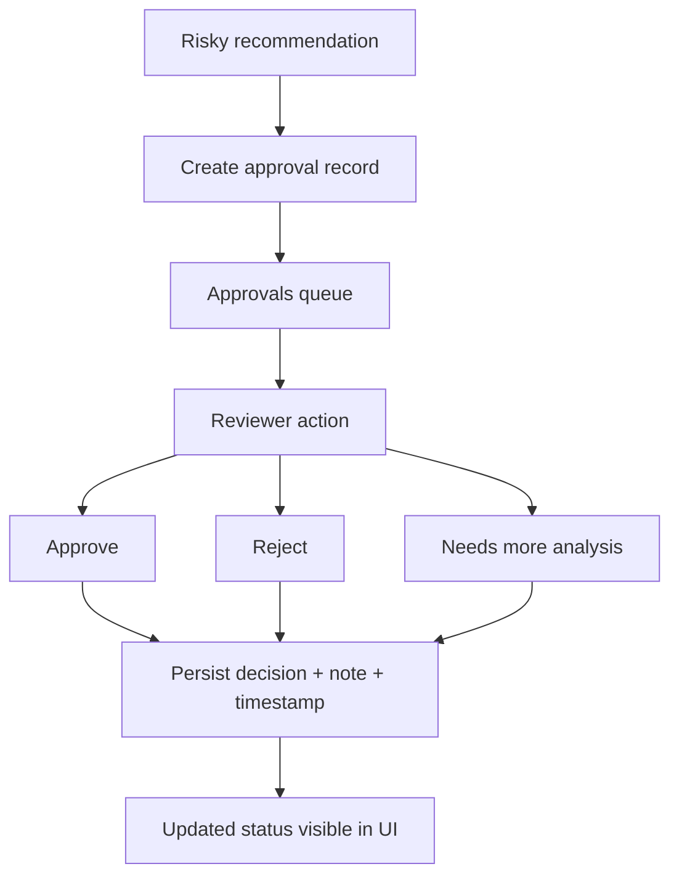
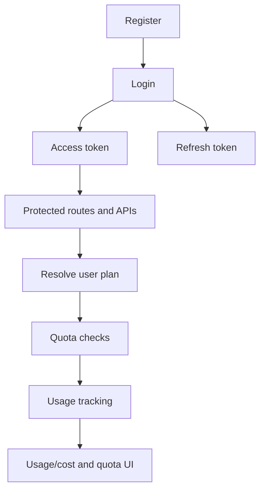
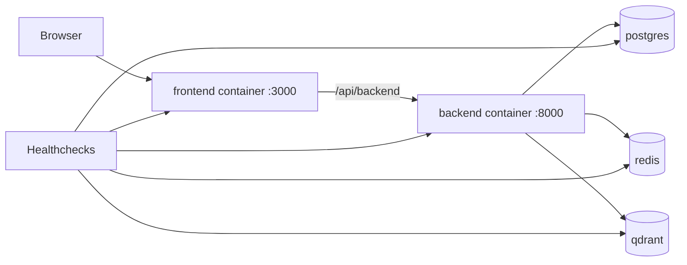

# Architecture

AlphaLens AI is a production-minded, reviewer-first investment intelligence
platform. It combines typed APIs, explicit agent orchestration, deterministic
fallbacks, human approval gates, and deployment-ready infrastructure.

## 1) System Architecture

**Notes**
- Frontend is the reviewer UI and proxy entrypoint.
- Backend owns orchestration, tool invocation, provider routing, and persistence.
- Redis, Postgres, and Qdrant are first-class infra dependencies.
- External providers are optional; deterministic fallback behavior is preserved.

## 2) Agent Workflow

**Steps**
- `interpret`: classify user intent and context.
- `gather`: retrieve portfolio/policy/market/news/macro/SEC/RAG evidence.
- `synthesize`: merge evidence into a coherent analysis.
- `decide`: produce typed recommendation, risk, confidence, and rationale.
- `compliance check`: attach policy flags, limitations, and approval reason.
- `approval gate`: create approval when risk/policy requires human review.
- `response generation`: return the answer plus decision metadata to frontend.

## 3) Tool and Provider Workflow

**Behavior**
- Services hide provider-specific details from the agent and API layer.
- Fallback clients keep behavior deterministic when keys/network are unavailable.
- Usage events are recorded for LLM calls, tool calls, errors, cache hits, and
  generated artifacts.

## 4) RAG Workflow

**Pipeline**
- Source docs live under `data/knowledge_base`.
- Markdown is ingested, chunked, embedded, and indexed in Qdrant.
- Retrieval returns evidence chunks used in chat/report reasoning and citations.

## 5) Human-in-the-Loop Workflow

**Auditability**
- Approval records preserve recommendation, evidence, rationale, and decisions.
- Action trail is user-scoped and persistence-ready for production.

## 6) Auth and SaaS Workflow

**Auth/SaaS controls**
- Auth endpoints issue bearer tokens and gate protected APIs.
- User plan metadata drives limits/capabilities and usage monitoring.
- Quota/usage status is surfaced in settings and usage dashboards.

## 7) Persistence Workflow

AlphaLens uses repository abstractions over SQLAlchemy-ready models while
preserving in-memory behavior for local/demo/test workflows.

**Persistence model**
- Repositories provide a stable contract to services.
- Postgres path is used in production-ready deployments (`APP_DATABASE_URL`,
  `PERSISTENCE_BACKEND=postgres`).
- In-memory fallback remains available for deterministic local/test runs.
- Data remains user-scoped at service/repository boundaries.

**Primary entities**
- users
- approvals
- feedback
- reports
- scenarios
- usage events
- conversation memory

## 8) Docker Workflow

**Container topology**
- `frontend` uses same-origin proxy routing to backend.
- `backend` serves API and agent workflow.
- `postgres`, `redis`, and `qdrant` provide infra dependencies.
- Healthchecks are defined for all services.
- Backend image includes repo `data/` to keep scenario/RAG runtime paths
  consistent inside Docker.

## Related Docs

- [README.md](../README.md)
- [setup.md](setup.md)
- [scripts.md](scripts.md)
- [codebase_guide.md](codebase_guide.md)
- [deployment.md](deployment.md)
- [demo_script.md](demo_script.md)
- [validation_report.md](validation_report.md)
