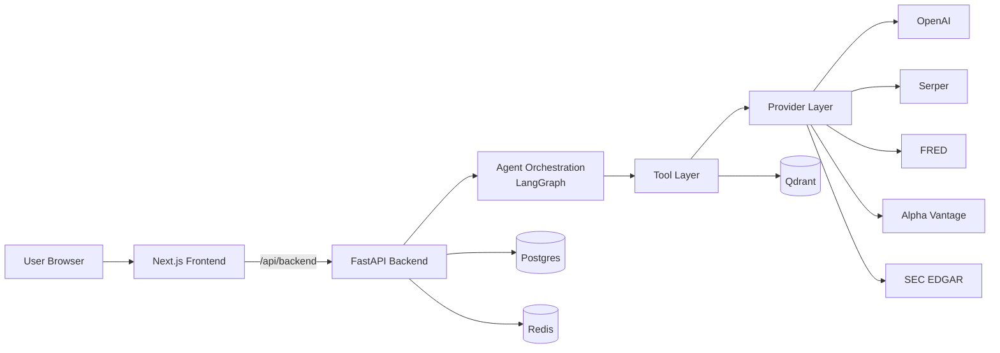
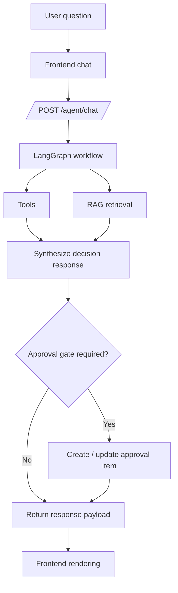
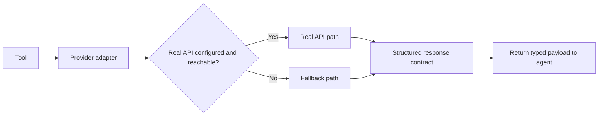
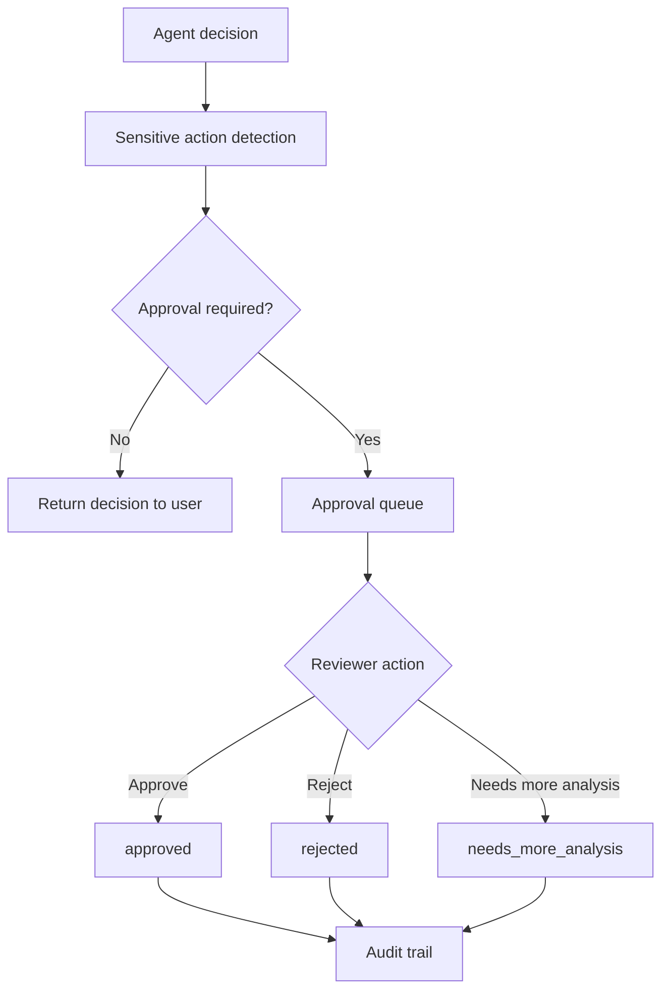

# Architecture

This document describes AlphaLens AI as a production-style agentic system with explicit orchestration, fallback providers, and human approval controls.

## A) System Architecture

## B) Request Flow

## C) Provider Fallback Architecture

## D) Human Approval Workflow

## Notes

- Agent execution and tool/provider calls are separated so each layer can be validated independently.
- Structured responses ensure the UI can render recommendation, evidence, approval state, and limitations consistently.
- Fallback providers keep the product demoable when external keys are absent.
- Approval and audit flows enforce governance for high-risk or weak-evidence recommendations.
