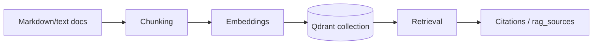

# Data Architecture

This document explains what data AlphaLens AI stores, where it lives, and how data flows through retrieval and decision workflows.

## 1) Demo Portfolio Data

Portfolio demo data includes:

- Holdings
- Market values
- Weights
- P&L signals
- Watchlist
- Cash
- Risk indicators

These datasets power portfolio analysis, concentration checks, and scenario-oriented responses.

## 2) Internal Knowledge Base

Seeded and uploaded knowledge sources include:

- Investment policy
- Risk playbook
- Committee notes
- Research notes
- AI infrastructure thesis
- Uploaded knowledge documents (`.md`/`.txt`)

## 3) RAG Data Flow

RAG outputs are surfaced as structured `rag_sources` and supporting evidence in agent responses.

## 4) Operational Data in Postgres

Postgres is the durable system of record for operational entities:

- Users
- Refresh tokens
- Approvals
- Feedback
- Reports
- Scenarios
- Usage events
- Conversation memory
- Investigations

## 5) Redis

Redis supports runtime operations:

- Caching
- Rate limiting
- Optional conversation memory backend

When Redis is unavailable, in-memory fallback paths are used in dev/test/demo workflows.

## 6) External Provider Data

External integrations provide contextual data:

- OpenAI (LLM and speech)
- Serper (web/news)
- FRED (macro)
- Alpha Vantage (market data)
- SEC EDGAR (filings context)

If providers are disabled or keys are missing, fallback behavior keeps the app functional and demo-ready.

## 7) Data Limitations and Production Improvements

Current limitations and upgrades:

- Real portfolio import not yet integrated
- Broker/CSV import workflows pending
- Market data SLA and freshness controls need formalization
- Filing parsing can be strengthened
- Data freshness timestamps can be surfaced more consistently
- Full portfolio transaction history can be expanded
- Benchmark data quality/depth can be improved
- Production schema evolution should use Alembic migrations
