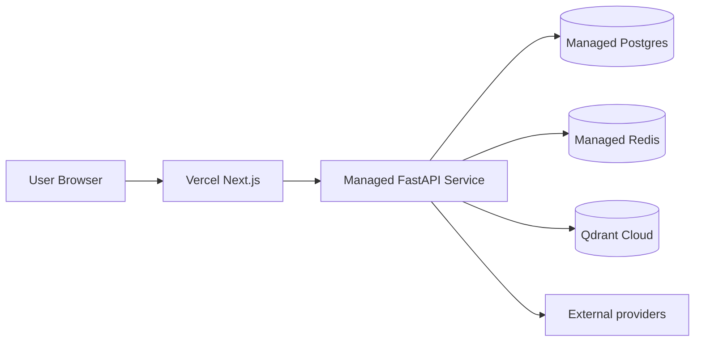

# Deployment

## 1) Local Docker Compose

Local stack is orchestrated with:

```bash
docker compose up --build
```

Services:

- Backend (FastAPI)
- Frontend (Next.js)
- Postgres
- Redis
- Qdrant

## 2) Managed Production Deployment

Recommended split deployment:

- Frontend: Vercel
- Backend: Render, Railway, or Fly.io
- Postgres: managed Postgres
- Redis: Upstash or managed Redis
- Qdrant: Qdrant Cloud

## 3) Environment Variables

Core production variables:

- `APP_ENV=prod`
- `APP_DATABASE_URL`
- `REDIS_URL`
- `QDRANT_URL`
- `OPENAI_API_KEY`
- `SERPER_API_KEY`
- `FRED_API_KEY`
- `ALPHA_VANTAGE_API_KEY`
- `NEXT_PUBLIC_API_URL=/api/backend`
- `BACKEND_INTERNAL_URL=https://<backend-origin>`

Never commit secrets.

## 4) Health Checks

Recommended availability checks:

- `/health`
- `/runtime/status`
- `/speech/capabilities`

## 5) Database Migrations

- Current code includes a dev/test schema guard for report schema drift
- Production migration lifecycle should be managed with Alembic

## 6) Smoke Test Checklist

After deploy, validate:

- Login/auth flows
- Agent chat responses
- RAG retrieval and source rendering
- Reports/memo generation
- Investigations persistence
- Approvals workflow
- Scenarios workflow
- Usage/feedback flows

## 7) Deployment Topology


