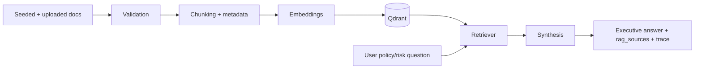

# RAG System

## 1) Seeded Documents

AlphaLens seeds a small internal corpus in `data/knowledge_base`, including policy/risk/research style documents used during demos and tests.

## 2) Uploaded `.md` and `.txt` Documents

Users can upload markdown/text knowledge docs through the Knowledge Base workflow. Uploaded files are validated and ingested into the same retrieval system as seeded docs.

## 3) Chunking and Metadata

Ingestion splits docs into chunks and stores metadata such as source path/title, chunk index, and ingest context so responses can surface traceable `rag_sources`.

## 4) Qdrant Retrieval

Chunks are embedded and stored in the configured Qdrant collection (`RAG_COLLECTION`). Query-time retrieval returns top relevant chunks for synthesis.

## 5) Deterministic Fallback Retrieval

When vector retrieval is unavailable or sparse in demo/test contexts, deterministic fallback retrieval keeps responses stable and prevents hard failures.

## 6) When RAG Is Triggered

RAG is triggered for:

- Internal policy questions
- Risk playbook questions
- Committee notes queries
- Research notes queries
- Uploaded document queries
- Explicit RAG prompts (for example “use RAG” or “source from KB”)

## 7) RAG Response Formatting

Investment responses are formatted to show:

- Clean executive answer (no raw chunk dump)
- Key evidence in analysis/decision context
- Collapsed RAG sources for reviewer traceability
- Technical trace metadata (tools selected/executed/skipped, limitations)

## 8) Limitations

- Demo corpus is intentionally small
- Embedding/retrieval quality depends on provider and corpus quality
- Source quality and document structure affect answer quality
- Ingestion scope currently focuses on `.md`/`.txt` workflows

## RAG Pipeline

