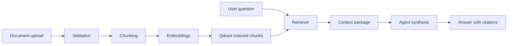

# RAG System

## 1) What RAG Means in AlphaLens

In AlphaLens, Retrieval-Augmented Generation (RAG) grounds agent responses with internal policy/research documents and user-uploaded knowledge. This reduces unsupported claims and improves explainability in investment recommendations.

## 2) What Documents Are Indexed

Indexed sources include:
- internal knowledge base documents under `data/knowledge_base/`;
- uploaded user documents from the knowledge base upload workflow.

## 3) How Upload Works

High-level flow:
- user uploads a supported document through the knowledge base UI/API;
- backend validates and normalizes content;
- ingestion service chunks and embeds text;
- embeddings + metadata are written to Qdrant;
- document becomes retrievable for future agent requests.

## 4) Supported Upload Formats

Current implementation is optimized for markdown/text-style ingestion in local/demo mode. Additional enterprise formats (PDF, DOCX, HTML with robust parsing) are roadmap enhancements.

## 5) Chunking

Documents are split into manageable chunks to balance:
- retrieval recall;
- token efficiency;
- citation granularity.

Chunk strategy keeps semantic coherence while preventing oversized context windows.

## 6) Metadata

Each chunk stores metadata used for filtering, tracing, and citations, typically:
- source identifier/path;
- document title or label;
- ingest timestamp;
- chunk order/index.

## 7) Embeddings

Chunks are transformed into embeddings and indexed in Qdrant. Embedding model selection and dimensions are configured in backend settings.

## 8) Qdrant Retrieval

At query time:
- user question is embedded;
- top-k relevant chunks are retrieved from Qdrant collection;
- retrieved evidence is sent to the agent synthesis stage.

## 9) Lexical Fallback

If vector retrieval is unavailable or sparse, lexical/fallback behavior can still provide baseline context in deterministic demo mode.

## 10) How RAG Is Triggered

RAG is triggered when intent detection identifies policy/document-reliant questions or when the workflow requires evidence grounding for recommendations and summaries.

## 11) How RAG Sources Are Displayed

Response payload includes RAG evidence references so UI can show:
- source names;
- cited snippets;
- traceability metadata alongside final answer.

## 12) RAG Limitations

- retrieval quality depends on corpus quality and chunking strategy;
- citation granularity may be coarse for long documents;
- permissions are not yet document-level RBAC hardened;
- large-scale ingestion orchestration is still maturing.

## 13) Future Improvements

- hybrid keyword plus vector search
- reranking
- document permissions
- citations with page numbers
- ingestion pipeline
- evaluation with RAGAS
- freshness monitoring

## RAG Pipeline Diagram

